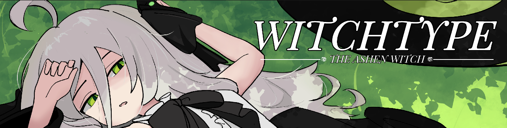
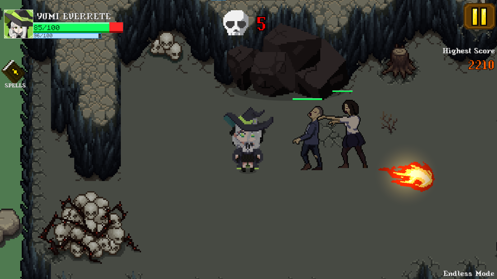
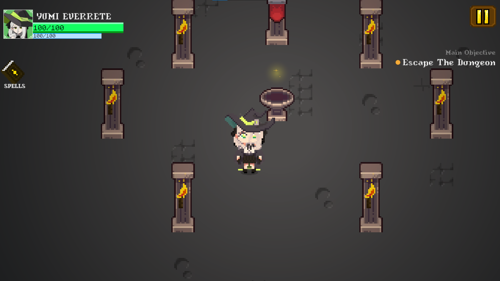
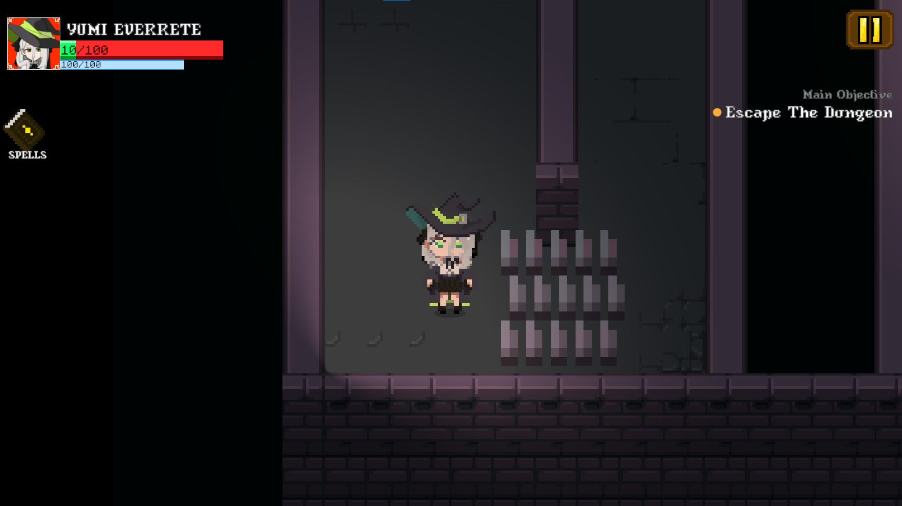
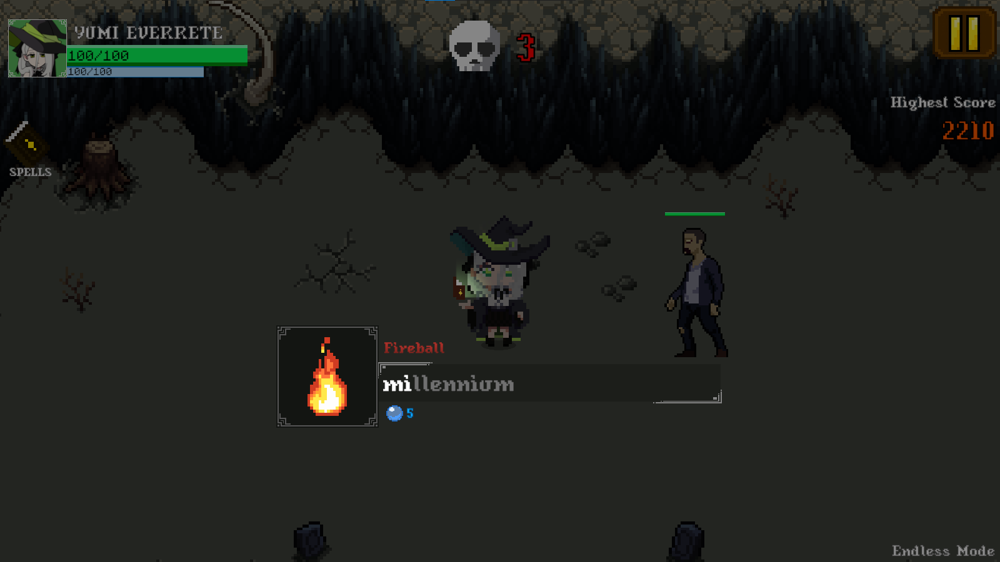
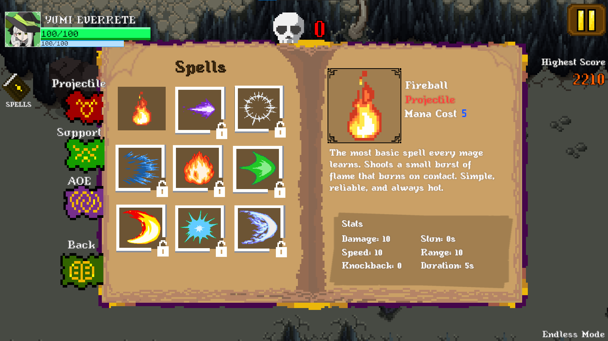
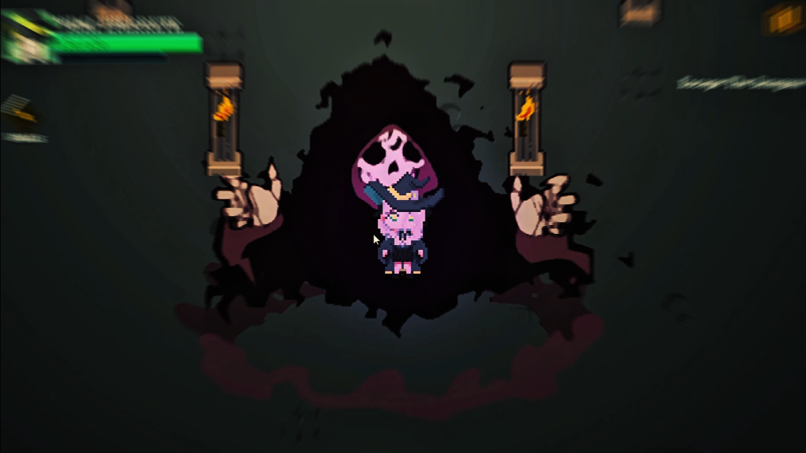

<div align="center">
  
</div>


## Description
This is a single player story based typing game where the player will play as Yumi Everrete known as the Ashen Witch. The game was developed using Unity 2D and will follow the character in 
her journey to escape the dungeon and find her missing twin sister who got corrupted by the book of darkness and prevent her sister from unleashing the chaos of calamity. [Download](https://imsauce.github.io/Sauce/html/witchtype.html)

### Genre


## Screenshots







## System Requirements

### Minimum
- **OS:** Windows 10 (64-bit)
- **Processor:** Dual-core CPU @ 2.0 GHz
- **Memory:** 8 GB RAM
- **Graphics:** Integrated graphics (Intel HD 4000 / AMD equivalent)
- **Storage:** 800 MB available space
- **Input:** Keyboard required
- **Sound:** Any Windows-compatible audio device


## How to contribute
1. Clone this repository:
    ```bash
    git clone https://github.com/ImSauce/WitchType
    ```
2. Make changes and test
3. Submit Pull Request with comprehensive description of changes

